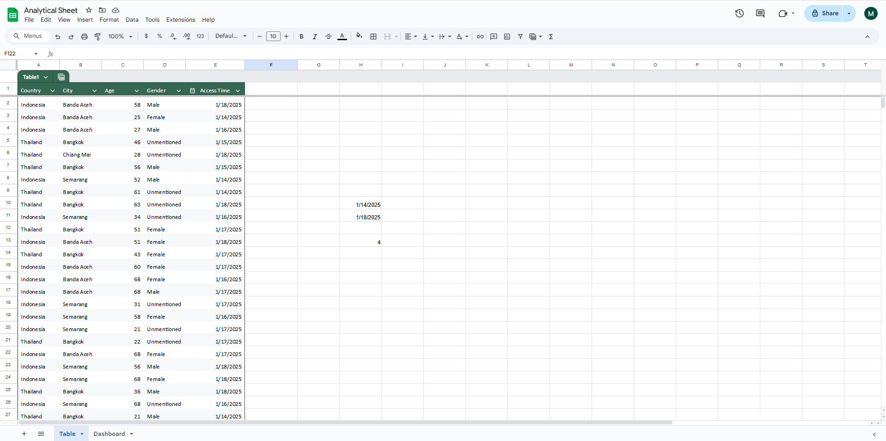

### 📊 Data Analysis & Visualization Project

#### 📝 Project Overview

This repository contains an analysis of a dataset related to tracking data, visualized using Power BI. The analysis aims to extract insights from the dataset and present them in a meaningful way using various visual representations.

#### 📂 Dataset Description

The dataset used in this project includes:

Tracking Data: Contains information related to various metrics and user activity.

Columns Analyzed: (List key columns after reviewing the dataset)

Data Source: Proprietary/Generated/Public dataset (Specify the origin)

#### 🔍 Key Insights & Findings

Trends Identification: Observing patterns in user behavior.

Performance Metrics: Analysis of key performance indicators.

Visual Representation: Graphs and charts summarizing data findings.

Actionable Insights: Recommendations based on data patterns.

#### 🖼️ Visual Representations

Below are the key visualizations generated from the dataset:

##### Dashboard Overview

Dataset Sample

#### 📌 How to Use This Repository

Clone the repository:

git clone [plant_sales_analysis](https://github.com/sakibahmed-da/plant_sales_analysis.git)

Open the dataset and explore the insights.

View the Power BI dashboard or analyze the data using Python/Excel.

#### 📊 Tools & Technologies Used

Google sheets: Cleaning, analysis, data manipulation and also data visualisation

#### 🏆 Conclusion

This analysis provides key insights into the dataset and demonstrates how data visualization can enhance decision-making. Future improvements may include deeper statistical analysis and predictive modeling.

##### 📌 Author:Sakib Ahmed
##### 📅 Date: February 2025

